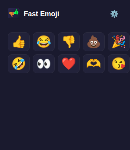

#  Fast Emoji

Copiez un emoji dans le presse-papier en un clic. Disponible en extension navigateur et en extension GNOME Shell.

  

## Extensions

| Extension | Plateforme | Installation |
| --- | --- | --- |
| [**chrome/**](chrome/) | Chrome, Firefox | Charger `chrome/dist/` dans le navigateur |
| [**gnome/**](gnome/) | Ubuntu (GNOME Shell 46) | `cd gnome && make install && make enable` |

Voir le README de chaque extension pour les instructions detaillees.

## Licence

MIT
