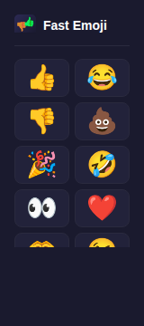

# Fast Emoji ⚡

Extension Chrome minimaliste pour copier un emoji dans le presse-papier en un clic.

<p align="center">
  
</p>

## Installation

```bash
make install
make build
```

Puis dans Chrome :

1. Ouvrir `chrome://extensions`
2. Activer le **Mode développeur** (en haut à droite)
3. Cliquer sur **Charger l'extension non empaquetée**
4. Sélectionner le dossier `dist/`

## Utilisation

Cliquer sur l'icône de l'extension dans la barre d'outils Chrome. La popup s'ouvre avec la grille d'emojis. Un clic copie l'emoji dans le presse-papier — le bouton passe brièvement en vert pour confirmer.

### Personnaliser les emojis

Cliquer sur l'icône ⚙️ dans la barre de titre pour ouvrir la banque d'emojis. Les emojis sont classés par catégorie (Smileys, Gestes, Coeurs, Celebration, Animaux, Nourriture, Objets, Symboles). Cliquer sur un emoji pour l'ajouter ou le retirer de la sélection. Les choix sont sauvegardés localement.

## Développement

```bash
make install       # Installer les dépendances
make watch         # Build avec rebuild automatique
make check         # Lancer tous les checks (types + format + tests)
```

### Commandes disponibles

| Commande            | Description                                  |
| ------------------- | -------------------------------------------- |
| `make install`      | Installer les dépendances                    |
| `make build`        | Build l'extension dans `dist/`               |
| `make watch`        | Mode dev avec rebuild on change              |
| `make clean`        | Nettoyer `dist/` et rebuild                  |
| `make typecheck`    | Vérification des types TypeScript            |
| `make format`       | Formater le code avec Prettier               |
| `make format-check` | Vérifier le formatage (CI)                   |
| `make test`         | Lancer les tests                             |
| `make test-watch`   | Tests en mode watch                          |
| `make check`        | Tous les checks (typecheck + format + tests) |

## Stack technique

- **Build** — esbuild (IIFE, target Chrome 120)
- **Langage** — TypeScript 5.7 (strict)
- **Tests** — Vitest + jsdom
- **Format** — Prettier
- **Extension** — Chrome Manifest V3

## Structure du projet

```
fast-emoji/
├── manifest.json        # Chrome Extension Manifest V3
├── package.json
├── tsconfig.json
├── vitest.config.ts
├── build.mjs            # Script de build esbuild
├── Makefile
├── icons/               # Icônes 16, 48, 128px
├── src/
│   ├── emojis.ts        # Liste des emojis par défaut
│   ├── emoji-bank.ts    # Banque complète (~335 emojis, 8 catégories)
│   ├── storage.ts       # Persistance des favoris (chrome.storage.local)
│   ├── popup.html
│   ├── popup.css
│   └── popup/
│       └── index.ts     # Logique popup, settings, copie clipboard
└── tests/
    ├── emojis.test.ts   # Tests sur la liste par défaut
    ├── emoji-bank.test.ts # Tests sur la banque d'emojis
    ├── storage.test.ts  # Tests du module de persistance
    └── popup.test.ts    # Tests DOM (rendu, settings, clipboard)
```

## Licence

MIT
